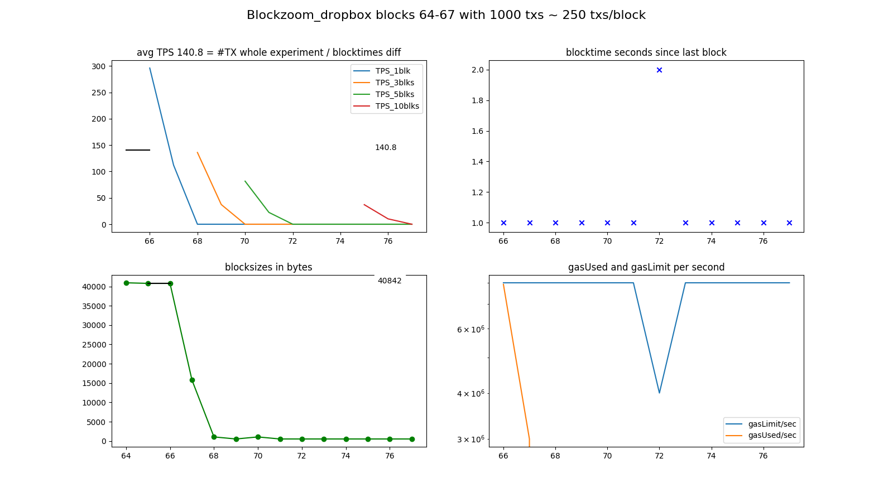

## (Blockzoom_dropbox) Geth v1.9.23 with 1000 txs: 140.8 TPS

### information:
```
NODE: Geth/v1.9.23-stable-8c2f2715/linux-amd64/go1.15 on http://localhost:8084
      consensus=ethash chain_name=??? chain_id=15 network_id=3576
SEND: 1000 transactions in blocks 64-67 with 10 empty blocks following.
      A sample of transactions looked as if they: succeeded.
TPS:  The stopclock watcher measured a final TPS of 124.0 since contract deploy,
      and in between saw values as high as 124.0 TPS.
DIAG: The whole experiment was prefixed 'Blockzoom_dropbox'.
      The diagrams were saved into 'img/Blockzoom_dropbox-20201026-0053_blks64-67.png'.
      Looking only at the experiment block-timestamps, the overall TPS was ~140.8.

```

### log:
```
versions: web3 4.8.2, py-solc: 3.2.0, solc 0.4.25+commit.59dbf8f1.Linux.gpp, testrpc 1.3.5, python 3.6.9 (default, Oct  8 2020, 12:12:24) [GCC 8.4.0]
web3 connection established, blockNumber = 57, node version string =  Geth/v1.9.23-stable-8c2f2715/linux-amd64/go1.15
first account of node is 0x283390fD02CB3493745Dc6A2efd574e9bFb6CC72, balance is 71.3125 Ether
nodeName: Geth, nodeType: Geth, nodeVersion: v1.9.23-stable-8c2f2715, consensus: ethash, network: 3576, chainName: ???, chainId: 15

Block  58  - waiting for something to happen
(filedate 1603669908) last contract address: 0xc305c901078781C232A2a521C2aF7980f8385ee9
(filedate 1603670031) new contract address: 0xAc620F94A654860a5983327D1d2133266b66E6CF

blocknumber_start_here = 62
starting timer, at block 62 which has  0  transactions; at epochtime 1603670031.1101577
block 63 | new #TX   0 / 1000 ms =   0.0 TPS_current | total: #TX    0 /  0.3 s =   0.0 TPS_average (peak  is   0.0 TPS_average)
block 65 | new #TX 592 / 4000 ms = 148.0 TPS_current | total: #TX  592 /  5.5 s = 106.7 TPS_average (peak  is 106.7 TPS_average)
block 66 | new #TX 296 / 1000 ms = 296.0 TPS_current | total: #TX  888 /  5.9 s = 150.5 TPS_average (peak  is 150.5 TPS_average)
block 67 | new #TX 112 / 1000 ms = 112.0 TPS_current | total: #TX 1000 /  8.1 s = 124.0 TPS_average (peak  is 124.0 TPS_average)
block 68 | new #TX   0 / 1000 ms =   0.0 TPS_current | total: #TX 1000 /  8.4 s = 119.2 TPS_average (peak was 124.0 TPS_average)
block 69 | new #TX   0 / 1000 ms =   0.0 TPS_current | total: #TX 1000 /  8.7 s = 114.8 TPS_average (peak was 124.0 TPS_average)
block 70 | new #TX   0 / 1000 ms =   0.0 TPS_current | total: #TX 1000 / 11.2 s =  89.6 TPS_average (peak was 124.0 TPS_average)
block 71 | new #TX   0 / 1000 ms =   0.0 TPS_current | total: #TX 1000 / 13.3 s =  75.1 TPS_average (peak was 124.0 TPS_average)
block 72 | new #TX   0 / 2000 ms =   0.0 TPS_current | total: #TX 1000 / 13.6 s =  73.4 TPS_average (peak was 124.0 TPS_average)
block 73 | new #TX   0 / 1000 ms =   0.0 TPS_current | total: #TX 1000 / 13.9 s =  71.7 TPS_average (peak was 124.0 TPS_average)
block 75 | new #TX   0 / 2000 ms =   0.0 TPS_current | total: #TX 1000 / 16.1 s =  62.1 TPS_average (peak was 124.0 TPS_average)
block 76 | new #TX   0 / 1000 ms =   0.0 TPS_current | total: #TX 1000 / 17.3 s =  57.7 TPS_average (peak was 124.0 TPS_average)
block 77 | new #TX   0 / 1000 ms =   0.0 TPS_current | total: #TX 1000 / 18.3 s =  54.8 TPS_average (peak was 124.0 TPS_average)
block 78 | new #TX   0 / 1000 ms =   0.0 TPS_current | total: #TX 1000 / 19.2 s =  52.1 TPS_average (peak was 124.0 TPS_average)
block 79 | new #TX   0 / 1000 ms =   0.0 TPS_current | total: #TX 1000 / 19.5 s =  51.3 TPS_average (peak was 124.0 TPS_average)
Received signal from send.py = updated INFOFILE.
Experiment ended! Current blocknumber = 79
Updated info file: last-experiment.json THE END.
```

### diagrams:


### info raw:
{'diagrams': {'blocktimestampsTpsAv': 140.8,
              'filename': 'img/Blockzoom_dropbox-20201026-0053_blks64-67.png',
              'prefix': 'Blockzoom_dropbox'},
 'node': {'chain_id': 15,
          'chain_name': '???',
          'consensus': 'ethash',
          'name': 'Geth',
          'network_id': 3576,
          'rpc_address': 'http://localhost:8084',
          'type': 'Geth',
          'version': 'v1.9.23-stable-8c2f2715',
          'web3.version.node': 'Geth/v1.9.23-stable-8c2f2715/linux-amd64/go1.15'},
 'send': {'block_first': 64,
          'block_last': 67,
          'empty_blocks': 10,
          'num_txs': 1000,
          'sample_txs_successful': True},
 'tps': {'finalTpsAv': 124.01429139453924,
         'peakTpsAv': 124.01429139453924,
         'start_epochtime': 1603670031.1101577}}
